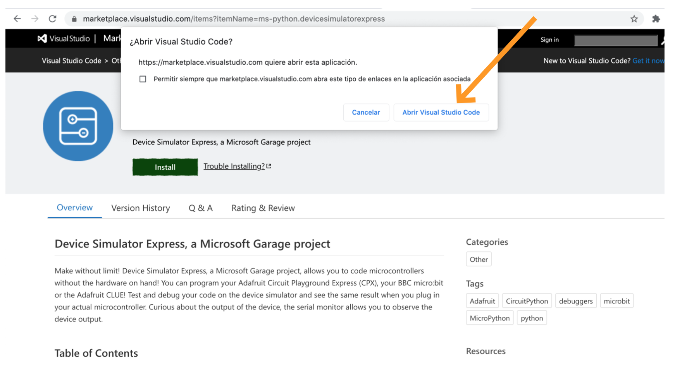

## How to do the set up for Adafruit Circuit Playground Express (CPX) Simulator
(For installations check src="installation.md")

The oficial documention could be visit in their oficial [website](https://marketplace.visualstudio.com/items?itemName=ms-python.devicesimulatorexpress)

- Install python 3.7+ or check that you are using this version or up of python. 
[warning tip]: If you have python2 in your system be aware that is not active, 

- Install Visual Studio Code. 

- Install the Device Simulator Express (Extension from the marketplace), once it is installed, you will need to reload VScode. In some cases it is needed close it and open it again (sometimes a couple of times).
.

