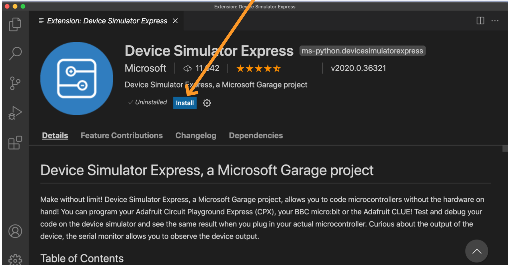
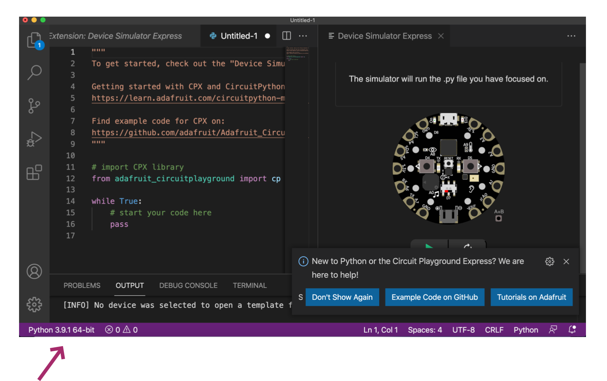
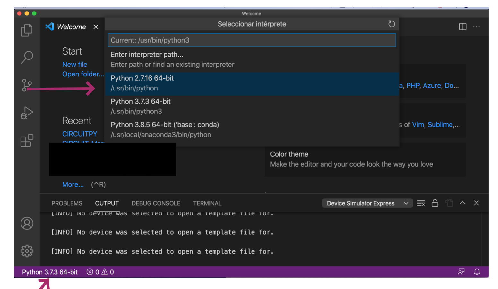

## How to do the set up for Adafruit Circuit Playground Express (CPX) Simulator

The oficial set up documention could be visit on their oficial
[website](https://marketplace.visualstudio.com/items?itemName=ms-python.devicesimulatorexpress)
______

 ### Installations (see installations.md)
 
- Install python 3.7+ or check that you are using this version or up of python. 
- [warning tip]: If you have installed `python2` in your system be aware that is not active, 

- Install Visual Studio Code. 

- Install the Device Simulator Express (Extension from the marketplace), once it is installed, you will need to reload VScode. In some cases it is needed close the Visual studio code and open it again (sometimes a couple of times).
______

 ### Set up:

**
- Click on the green button **Install** for Device Simulator Express, 
after that it will pop-up a message asking if you want to open the Visual Studio code. 

- *Click* **Open Visual Studio Code** 

- Click on the button **Open Visual Studio Code**,
your VSCode should be opened automatically.

In that point will appear a screen with the Device Simulator Express Installation. 
- *Click* **Install**

If all goes ok, you would be able to don´t see any special screen. 
Go to :
  - `View` > `Command Palette` 
  - or use for Mac `cmd + shift + p` or for Windows/Linux `cntl + shift + p`

After *click* **Device Simulator Express**, you will need to wait some seconds until appear three options of simulators. 
In our case will work with "CircuitPlayground Express. 
If nothing happen wait a bit more, after a while retry to click again, if not go to the "problems section".

[Extra info]On these images the arrow purple are indicating who different python version working. 
Once appears the different options of simulators, we will select the CircuitPlayground Express and will appear the simulator 

In this case, it was running 3.9.1, but run python 3.7+ will work good. 
after all these steps, we will arrive to the final screen divided in two. 
On the left, we have some information about tutorial a official documentation about CircuitPython and it will be the coding area.
On the right on top we should see a microcontroller (CPX)

## Possible problems and how to solve them:

The first arrow shows that the `python2` is running, while on the bottom looks like it is `python 3.7+`.
The version running was `python2.7`and was not working. 

