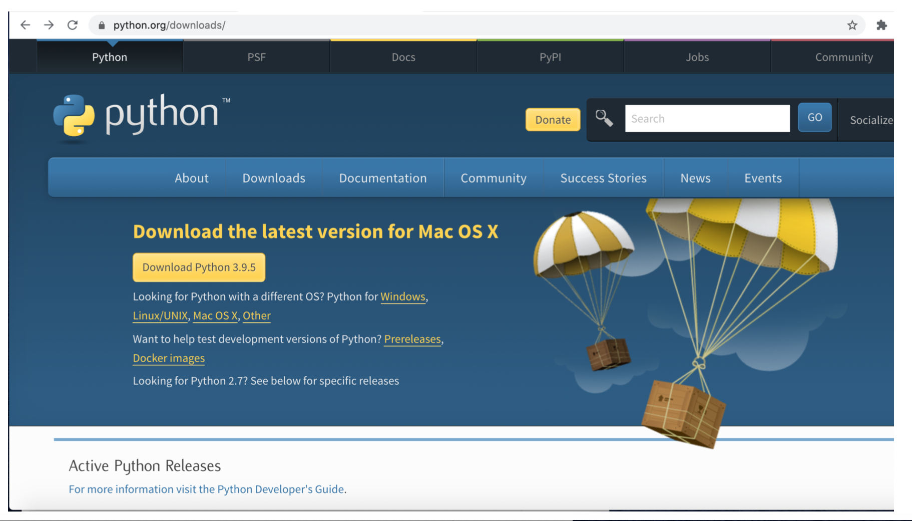
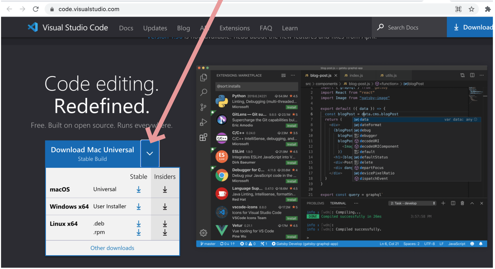
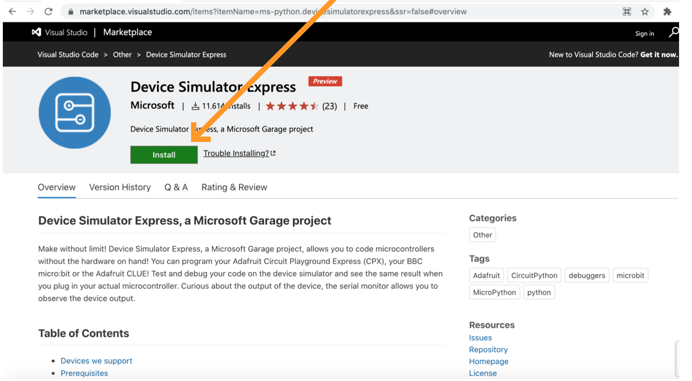

# Installation requirements

If you have done some of the following steps, just skip them.
Be sure that your version is compatible with the requirements below.

**Content**
* [Install Python 3.7+](#install-python-37)
* [Install Visual Studio Code](#install-visual-studio-code)
* [Install Device Simulator Express](#install-device-simulator-express)

******
## Install Python 3.7+:

Python can be [downloaded](https://python.org/download) from their
official website for macOS, Linux or Windows.

For macOS users and Linux there are some alternatives:
- macOS users can use brew (if present), running `brew install python3`,
- Linux users should have python3 installed, already! if not check
  your package manager.

* **Important:** Make sure to add Python to your PATH with the Windows
  installer, with the other OS you should have `python` or `python3`
  already in your path: check it out with `python --version` 
  (or `python3 --version`).
  
  

## Install Visual Studio Code:

Visual Studio Code is necessary to use the Device Simulator Express
and to be able to code microcontroller without the device.

It can be [downloaded](https://code.visualstudio.com/) from their
official website for macOS, Linux or Windows.
(Some Linux users should have it available in the official OS
repository, e.g. `pacman -S code` for Manjaro and Arch)

## Install Device Simulator Express:

This Device Simulator allows your to code microcontrollers without
having the physical hardware.
[It can be downloaded](https://marketplace.visualstudio.com/items?itemName=ms-python.devicesimulatorexpress)
from its official website.

### Extra information to have in consideration:

If you are running `python 3.9`, the Device
Simulator Express installation will not work correctly at least that you change
the version of one dependency: `pillow==7.0.0` to `pillow==8.1.0`. See the
[website](https://github.com/microsoft/vscode-python-devicesimulator/issues/377)

**Solution:**
Modify the pillow version following the path and modify it in the requirement file:

* Linux/macOS: `.vscode/extensions/ms-python.devicesimulatorexpress-2020.0.36321/out/requirements.txt`
* Windows: `.vscode\extensions\ms-python.devicesimulatorexpress-2020.0.36321\out\requirements.txt`

or use a previous version of python.
