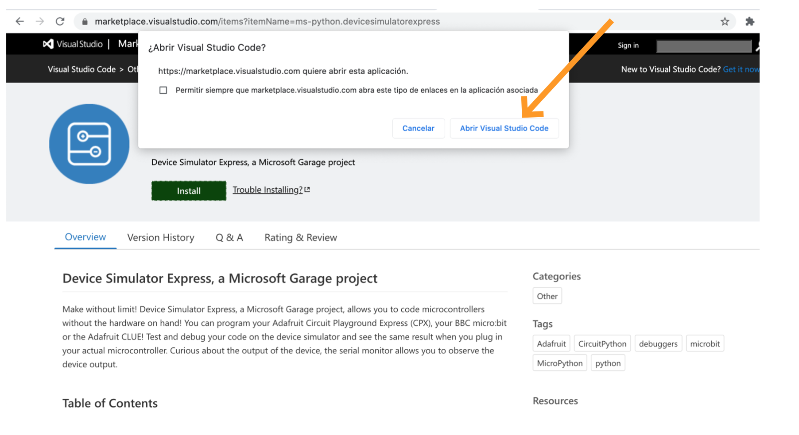
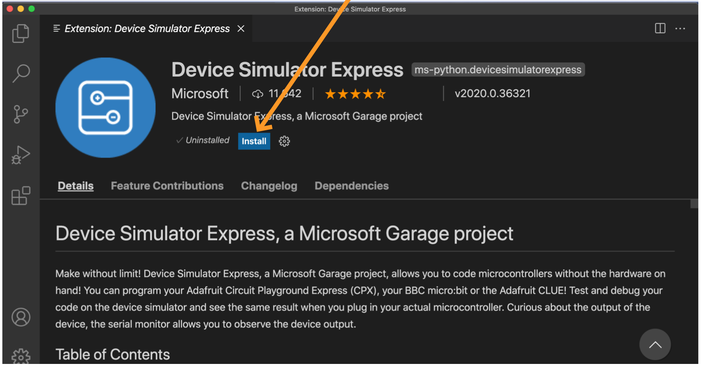
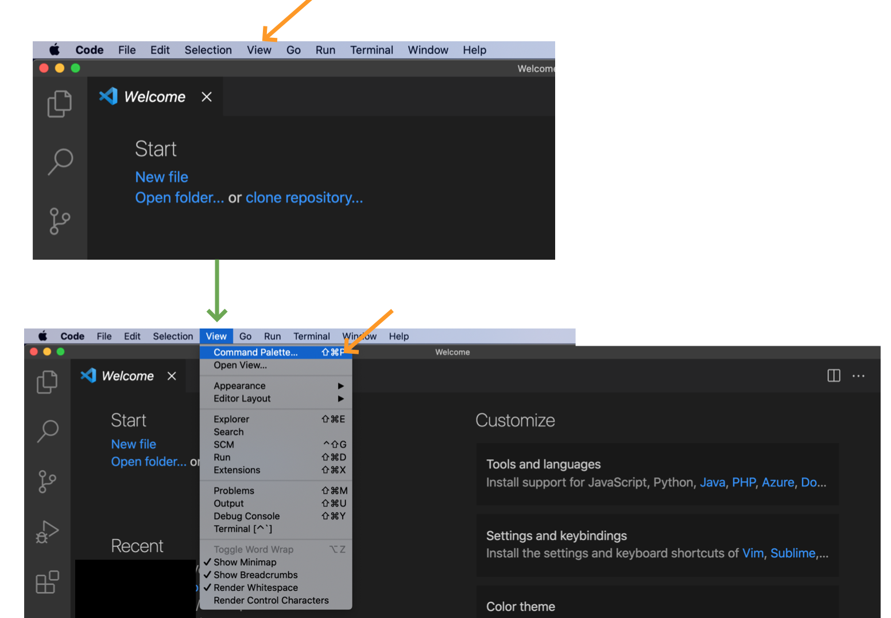
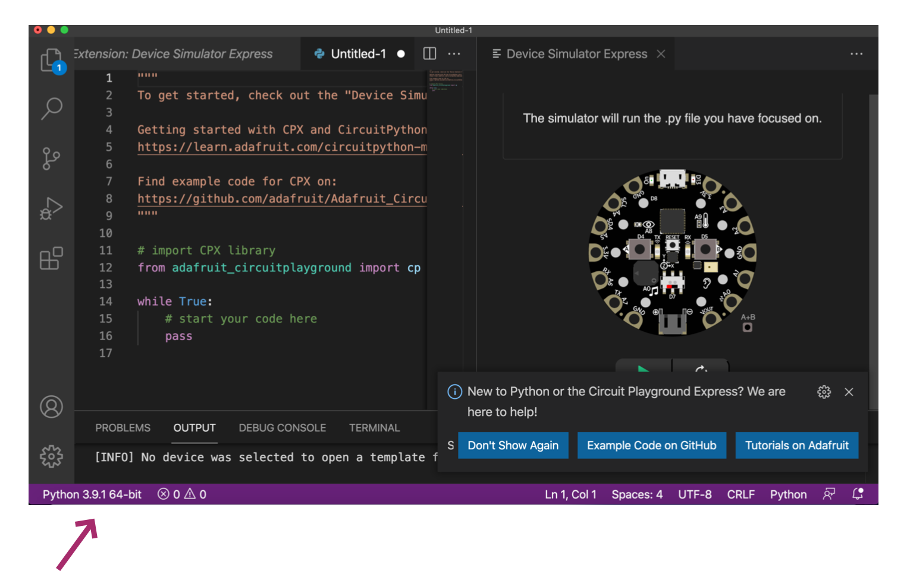

## How to do the set up for Adafruit Circuit Playground Express (CPX) Simulator


The official set up documentation can be visited in their official
[website](https://marketplace.visualstudio.com/items?itemName=ms-python.devicesimulatorexpress)

______

### Installations (see installations.md)
 
- Install python 3.7+ or check that you are using this version or up of python. 

**Important information**: If you are running `python 3.9 +`, the device simulator express installation will not work correctly at least that you change de version of one dependency: `pillow==7.0.0` to `pillow==8.1` (See: [website](https://github.com/microsoft/vscode-python-devicesimulator/issues/377) )

*How to solve it?* 
Modify the pillow version following the path and modify it in the requirement file:
*Unix: .vscode/extensions/ms-python.devicesimulatorexpress-2020.0.36321/out/requirements.txt
*Windows:.vscode\extensions\ms-python.devicesimulatorexpress-2020.0.36321\out\requirements.txt
or use a previous version of python. 

  [warning tip]: If you have installed `python2` in your system make sure it
  is not active as your default `python` command.

- Install Visual Studio Code. 

- Install the Device Simulator Express (Extension from the marketplace).
  Once it is installed, you will need to reload VScode. 

In some cases it is necessary to close it and open again (sometimes a couple of times).
______

### Set up:

- Click on the green button **Install** for Device Simulator Express, 
  after that it will pop-up a message asking if you want to open
  Visual Studio code. 

- *Click* **Open Visual Studio Code** 




- Click on the button **Open Visual Studio Code**,
  your VSCode should be opened automatically.

At that point, a screen will appear with the Device Simulator Express Installation. 

- *Click* **Install**



If all goes OK, you would be able to don´t see any special screen. 

Go to :

  - `View` > `Command Palette` 
  - or use for Mac `cmd + shift + p` or for Windows/Linux `cntl + shift + p`




After *click* **Device Simulator Express**, you will need to wait some seconds
until three options of simulators appear. 

- In our case will work with "CircuitPlayground Express". 
If nothing happens wait a bit more, after a while retry to click again,
if not go to the "problems section".


[Extra info]On these images the purple arrows are indicating different python working version. 

Once the different options of simulators appear, we will select the
CircuitPlayground Express and the simulator will appear.


After all these steps, we will arrive to the final screen divided in two. 
On the left, we have some information about a tutorial from the official
documentation about CircuitPython and the coding area.
On the right, on top we should see a microcontroller (CPX) image.



______

## First steps:

Let´s start writing our first circuipython code to test that everythings is ok. 


- On the left write this code:


``` 
#import CPX library 

from adafruit_circuitplayground import cp

while True:
    # start your code here
    cp.pixels.fill((0, 250, 0)) #add this line of code
    pass
```


- On the right:
- *Click* on the button `play`== button with the green arrow. You should see that pixels are turn on green!

-**important:** Rememeber save your file as `code.py`!!


**Congrats! Your installation and set up is done, you are ready!**


If you didn´t achieve it, don´t worry, go to the possible problems or review the installations and set-up steps.


_______

### Possible problems and how to solve them:

The first arrow shows that `python2` is running, while on the bottom
it looks like it is `python 3.7+`.
Since the running version was `python2.7` it was not working. 


